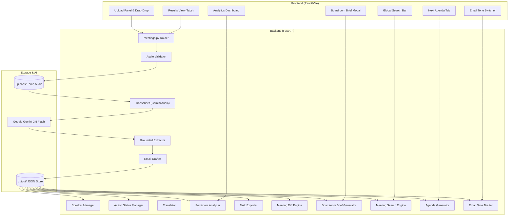
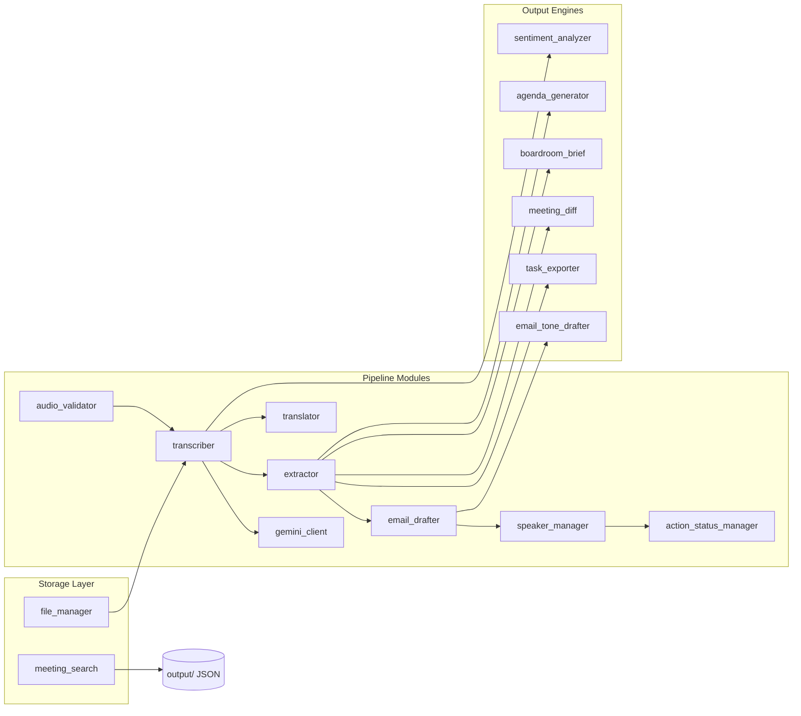

# Debrief — AI Meeting Intelligence Platform

A production-grade, AI-augmented meeting intelligence platform powered by **FastAPI** and **Google Gemini 2.5**. Ingests meeting audio uploads (MP3, WAV, M4A, AAC, FLAC, OGG, WebM), generates timestamped speaker-labeled transcripts using Gemini's native audio understanding, extracts strictly grounded action items and decisions (every item must include a verbatim `source_excerpt` from the transcript to prevent hallucination), synthesizes ready-to-send follow-up emails, and provides CSV, iCalendar, Markdown, plain-text, and executive boardroom brief export options — with a full suite of 12 advanced intelligence features for professional meeting management.

## Features

### Core Pipeline
- **Native Audio Transcription**: Gemini 2.5 ingests audio directly (via inline bytes for files under 20 MB, Google Files API for larger recordings) to produce a structured transcript with per-segment speaker labels, start timestamps, and end timestamps. Falls back to prose parsing if JSON diarization is unavailable.
- **Grounded Structured Extraction**: Gemini extracts action items, agreed decisions, key discussion points, and open questions from the transcript with a strict anti-hallucination contract — every `ActionItem` and `Decision` record must include a `source_excerpt` field quoting the exact transcript passage that justifies the extraction. Items without a verbatim quote are discarded during parsing.
- **Follow-Up Email Synthesis**: Converts the structured extraction output into a reviewable, ready-to-send follow-up email draft prefixed with `[DRAFT — PLEASE REVIEW BEFORE SENDING]`. Gemini is prompted with a system instruction role as an executive assistant.
- **Meeting Summary Persistence**: Saves each processed meeting summary as a structured JSON file in the `output/` directory, keyed by a unique `meet_{hex8}` ID. All subsequent API operations (rename, export, analytics, brief) load from this persisted store.
- **Audio File Validation**: Enforces allowed extensions (MP3, WAV, M4A, AAC, FLAC, OGG, WebM), MIME type verification, maximum upload size (configurable, default 500 MB), and non-empty file guard before the audio ever reaches Gemini.

### Advanced Features
- **Speaker Diarization & Custom Speaker Renaming**: Post-processing speaker label remapping engine that replaces generic labels (`"Speaker 1"`, `"SPEAKER_00"`) with human names across the full meeting summary — transcript segments, action item owners, and the stored `speaker_map`. Updates are persisted back to the JSON store. Exposed as `PATCH /meetings/{id}/speakers`.
- **Audio Player & Timestamp Synchronization**: Timestamp calculator that computes per-segment playback markers (`start_time`, `end_time`) from the transcript, enabling the frontend audio player to highlight the currently-playing transcript segment in real time. Exposes a `format_timestamp(seconds)` utility (`MM:SS`) and an `estimate_duration()` function for the waveform progress bar.
- **Multi-Format Task Exporter**: Exports action items from any saved meeting in three formats: **CSV spreadsheets** (compatible with Excel/Sheets), **iCalendar `.ics`** calendar event files (importable into Google Calendar, Outlook, Apple Calendar), and **Markdown checklists** with checkbox syntax, owner attribution, and grounding quotes. Exposed as `GET /meetings/{id}/tasks/export?format=csv|ics|markdown`.
- **Interactive Action Item Status Manager**: Updates the status of individual action items (`open` → `in_progress` → `completed`) within a persisted meeting summary and writes the change back to disk. Validates status values server-side and raises `422 Unprocessable Entity` on invalid inputs. Exposed as `PATCH /meetings/{id}/actions/{action_id}`.
- **Meeting Dynamics & Talk-Time Analytics**: Computes per-speaker word-count distribution (as percentage of total words), classifies meeting tone (*Productive*, *Consensus-Heavy*, *Debated*, *Monologue*) using a participation ratio heuristic, and returns a `participation_ratio` index (1.0 = balanced, < 0.5 = dominated). Exposed as `GET /meetings/{id}/analytics` with a `MeetingAnalytics` response model.
- **Multi-Language Synthesis**: Translates follow-up emails, summaries, and executive memos into target languages (English, Spanish, French, German, Japanese, Chinese) via a Gemini-powered translation pass that preserves markdown structure, action item formatting, and source quote fidelity. Configurable via `output_language` query parameter on the upload endpoint.
- **Executive Email Tone Selector**: Re-drafts follow-up emails in three distinct executive styles: **Action-Oriented** (tasks and deadlines lead), **Formal Boardroom** (corporate salutations, strategic overview), and **Concise Slack** (brief bulleted digest for team chat). Each tone has a dedicated Gemini system instruction prompt. Exposed as `POST /meetings/{id}/re-draft-email?tone=...` and wired to the frontend tone switcher.
- **Meeting Series Comparison & Sync Delta**: Compares any two saved meeting summaries (e.g. Sprint Sync Week 1 vs Week 2) to surface newly added action items, resolved previous items, ongoing carry-overs, new decisions made, and open questions that carried over unresolved. Uses normalized description matching for fuzzy de-duplication. Exposed as `GET /meetings/{id}/diff?against={previous_id}`.
- **Printable 1-Page Boardroom Brief**: Formats a meeting summary into a structured, print-ready executive memorandum — with decisions, action item assignments, open issues, and a confidentiality footer — entirely without an external API call. Exposed as `GET /meetings/{id}/brief` and wired to a frontend print modal with native `window.print()` support.
- **Full-Text Meeting Search Engine**: Searches all saved meeting JSON files in the output directory by keyword — scoring matches against the transcript full text (weight 1×), filename (weight 5×), action item descriptions (weight 3×), and decisions (weight 3×). Results are ranked by match score descending. Exposed as `GET /meetings/search?q=...` and integrated into the frontend header search bar.
- **Next Meeting Agenda Generator**: Automatically generates a Markdown-formatted agenda for the next meeting, populated with all pending (non-completed) action items from the current summary and all unresolved open questions — ready to copy-paste into a calendar invite or meeting doc. Exposed as `GET /meetings/{id}/next-agenda`.
- **Smart Meeting Title Generator**: Uses Gemini to auto-generate a sharp, professional 5–8 word meeting title from key discussion points and filename context, replacing generic audio filenames (`sprint_sync.mp3`) with descriptive titles (`"Q3 Backend Migration & Database Strategy"`). Includes fallback title cleaning and a frontend regenerate button. Exposed as `POST /meetings/{id}/generate-title`.
- **Meeting Delivery Risk Detector**: Analyzes meeting summaries in pure Python (<1ms, 0 Gemini API cost) for delivery risk signals — unassigned action items, missing target due dates, single-owner task overload (>50% of tasks assigned to 1 person), and excessive open questions. Returns an aggregate risk score (0–100), risk level (*LOW*, *MEDIUM*, *HIGH*), itemized flags with severity ratings, and actionable mitigation recommendations. Exposed as `GET /meetings/{id}/risk-report` and rendered in the frontend Risk Detector dashboard tab.

### Export & Output Formats
- **Markdown Export**: Full meeting summary formatted as a structured Markdown document with headings, bullet lists, blockquote grounding quotes, and the email draft.
- **Plain Text Export**: Compact plain-text version of the meeting summary for email-body pasting or terminal output.
- **CSV Task Export**: Action items as a CSV with columns for ID, description, owner, due date, status, and source excerpt.
- **iCalendar Task Export**: Action items as `VTODO` calendar entries with `DUE`, `ORGANIZER`, and `STATUS` fields populated from the action item data.
- **Markdown Checklist Export**: GitHub-compatible checklist format with checkboxes, owner attribution, due dates, and embedded source quotes.
- **Boardroom Brief Export**: Formatted plain-text executive memo copied to clipboard or printed directly from the browser.

### Data Integrity & Anti-Hallucination
- **Grounded Source Excerpts**: Every `ActionItem` and `Decision` must include a `source_excerpt` quoting the verbatim transcript passage that justifies the extraction — enforced at the Pydantic model layer via a `min_length=1` validator. Items without quotes are silently discarded during JSON parsing.
- **Structured JSON Parsing with Fallback**: The extractor strips Markdown fences, attempts JSON parsing, and falls back to empty lists with a `confidence_note` warning if the model returns malformed output — ensuring the pipeline never crashes on unexpected Gemini responses.
- **Transcript Prose Fallback**: If Gemini does not return structured JSON for the transcript, the transcriber wraps the full prose response in a single segment with no speaker label — guaranteeing a usable `Transcript` object is always returned.
- **File Safety**: All uploaded audio files are saved to a temp path and deleted in a `finally` block after pipeline completion, regardless of success or failure.

## Tech Stack

### Backend
- **Python 3.11+** with FastAPI 0.115+
- **Pydantic V2** for strict schema validation, model serialization, and anti-hallucination data contracts
- **Google Gemini 2.5 Flash** (`google-genai >= 0.1.0`) for native audio understanding, structured extraction, email drafting, and multi-language synthesis
- **Uvicorn** for ASGI serving with `--reload` hot-reload support
- **python-multipart** for audio file upload handling
- **python-dotenv** for environment variable management
- **pytest + pytest-asyncio** for unit and integration testing

### Frontend
- **React 19** with Vite 8
- **Vanilla CSS** with custom design tokens (Slate/Steel dark theme — `#0f1011` base, `#4a9eff` accent)
- **Inter** (body) + **JetBrains Mono** (monospace) via Google Fonts
- **Custom `CustomSelectDropdown`** component replacing all native `<select>` OS popovers with styled custom menus

### Other
- **Git** with 46+ atomic feature commits across `feat/`, `test/`, `chore/`, and `docs/` prefixes
- **pytest** (91 tests, 100% passing) covering unit tests for all pipeline modules, output engines, and integration tests for all API endpoints

## System Architecture



## Module Dependency



## Project Structure

```
ai-meeting-summarizer/
├── src/
│   ├── main.py                         # FastAPI application entrypoint, CORS, lifespan
│   ├── config.py                       # Pydantic settings — API key, model, thresholds
│   ├── models/
│   │   └── schemas.py                  # Pydantic V2 models: MeetingSummary, ActionItem, Decision,
│   │                                   #   Transcript, TranscriptSegment, MeetingAnalytics, SpeakerMap
│   ├── pipeline/
│   │   ├── audio_validator.py          # Extension, MIME, size guard; FileManager save/delete
│   │   ├── transcriber.py              # Gemini native audio → Transcript (inline + Files API)
│   │   ├── extractor.py                # Grounded ActionItem & Decision extraction with source_excerpt
│   │   ├── email_drafter.py            # Follow-up email draft generator
│   │   ├── speaker_manager.py          # Speaker label remapping across transcript + action items
│   │   ├── action_status_manager.py    # Action item status toggle (open/in_progress/completed)
│   │   ├── audio_player_utils.py       # Playback marker calculator, timestamp formatter
│   │   └── translator.py               # Multi-language synthesis via Gemini
│   ├── output/
│   │   ├── task_exporter.py            # CSV, ICS iCalendar, Markdown checklist export
│   │   ├── sentiment_analyzer.py       # Talk-time distribution, tone classification
│   │   ├── email_tone_drafter.py       # Executive tone re-drafter (3 styles)
│   │   ├── meeting_diff.py             # Meeting series progress comparison engine
│   │   ├── boardroom_brief.py          # 1-page printable boardroom memo generator
│   │   └── agenda_generator.py         # Next meeting agenda markdown generator
│   ├── storage/
│   │   ├── file_manager.py             # Temp audio file save/delete with unique naming
│   │   └── meeting_search.py           # Full-text keyword search across saved JSON summaries
│   ├── services/
│   │   └── gemini_client.py            # GeminiService — inline audio, Files API, generate_text
│   └── routes/
│       └── meetings.py                 # All API endpoints (/upload, /search, /speakers,
│                                       #   /analytics, /brief, /diff, /tasks/export, /next-agenda)
├── tests/
│   ├── test_audio_validator.py         # 14 tests — extension, MIME, size, FileManager
│   ├── test_transcriber.py             # 14 tests — parse, fallback, flatten, strip fences
│   ├── test_extractor.py               # 13 tests — extraction, source excerpts, JSON parsing
│   ├── test_email_drafter.py           # 10 tests — draft output, prompt building
│   ├── test_speaker_manager.py         # 2 tests — rename across transcript and action items
│   ├── test_action_status_manager.py   # 4 tests — status toggle, invalid status, missing ID
│   ├── test_audio_player_utils.py      # 6 tests — marker filtering, timestamp format, duration
│   ├── test_task_exporter.py           # 7 tests — CSV columns, ICS VTODO, Markdown checklist
│   ├── test_sentiment_analyzer.py      # 3 tests — empty, balanced, monologue classification
│   ├── test_advanced_features.py       # 4 tests — boardroom brief, agenda, diff, search
│   ├── test_schemas.py                 # 9 tests — Pydantic model validation
│   └── test_integration.py            # 5 tests — health, root, upload/get/export flow, 404s
├── frontend/
│   ├── index.html                      # Vite entrypoint, Inter + JetBrains Mono fonts
│   ├── public/
│   │   └── favicon.svg                 # Custom Debrief favicon (document + audio waveform icon)
│   ├── vite.config.js                  # Vite proxy: /meetings → http://127.0.0.1:8000
│   └── src/
│       ├── main.jsx                    # React root mount
│       ├── App.jsx                     # Full application — upload, pipeline, results, all tabs
│       ├── api.js                      # API client helpers for all backend endpoints
│       ├── index.css                   # Full design system — custom properties, components
│       └── components/
│           └── CustomSelectDropdown.jsx # Branded custom popover dropdown (replaces <select>)
├── pyproject.toml                      # pytest config, asyncio mode
├── requirements.txt                    # Python dependency pinning
├── .env                                # GEMINI_API_KEY, model name, thresholds (gitignored)
├── .gitignore                          # Excludes .env, uploads/, output/, __pycache__
└── README.md
```

## API Reference

The backend follows a RESTful pattern. All endpoints are mounted under `/meetings`.

- **Health**: `GET /health` — Gemini API key status check and uptime confirmation.
- **Upload & Process**: `POST /meetings/upload` — Upload audio, run the full 5-stage pipeline (validate → transcribe → extract → draft email → persist). Accepts `output_language` query param for multi-language synthesis.
- **Retrieve Summary**: `GET /meetings/{id}` — Load a previously processed meeting summary by ID.
- **Search**: `GET /meetings/search?q={query}` — Full-text keyword search across all saved meeting JSON files with match scoring.
- **Rename Speakers**: `PATCH /meetings/{id}/speakers` — Bulk-rename speaker labels across the transcript, action item owners, and speaker map. Body: `{"Speaker 1": "Alice", "Speaker 2": "Bob"}`.
- **Update Action Status**: `PATCH /meetings/{id}/actions/{action_id}` — Set an action item's status to `open`, `in_progress`, or `completed`.
- **Analytics**: `GET /meetings/{id}/analytics` — Speaker talk-time distribution, meeting tone classification, and participation balance index.
- **Boardroom Brief**: `GET /meetings/{id}/brief` — Plain-text 1-page executive boardroom memo.
- **Next Agenda**: `GET /meetings/{id}/next-agenda` — Markdown agenda for the next meeting, built from pending items and open questions.
- **Meeting Diff**: `GET /meetings/{id}/diff?against={old_id}` — Compare two meetings: new vs resolved vs ongoing action items, new decisions, carryover questions.
- **Re-Draft Email**: `POST /meetings/{id}/re-draft-email?tone={tone}` — Re-synthesize follow-up email in `action_oriented`, `formal_boardroom`, or `concise_slack` tone.
- **Export Summary**: `GET /meetings/{id}/export?format={markdown|text}` — Full meeting summary as Markdown or plain text.
- **Export Tasks**: `GET /meetings/{id}/tasks/export?format={csv|ics|markdown}` — Action items as CSV, iCalendar, or Markdown checklist.

## Quick Start


### 1. Install Dependencies & Run Backend

```bash
pip install -r requirements.txt
uvicorn src.main:app --reload --port 8000
```

API docs available at `http://localhost:8000/docs`.

### 2. Run Frontend

```bash
cd frontend
npm install
npm run dev
```

Open `http://localhost:5173` in your browser.

### 3. Run Test Suite

```bash
pytest tests/ -v
```

Expected: **91 tests, 0 failures**.

## Features in Detail

### Grounded Extraction & Anti-Hallucination Contract

Every `ActionItem` and `Decision` produced by the pipeline includes a mandatory `source_excerpt` field that must quote a verbatim passage from the transcript. This is enforced at two layers: the Gemini prompt explicitly instructs the model that items without a direct quote must not be returned, and the Pydantic parser silently discards any item where `source_excerpt` is absent, empty, or under 1 character. This dual-layer approach means the application will never surface a task that was not explicitly discussed in the meeting recording — a critical property for professional deployment.

### Native Audio Understanding

Rather than sending audio to a speech-to-text service and then re-prompting for extraction, the pipeline uses Gemini's native multimodal audio input to produce a structured JSON transcript in a single API call. For files below 20 MB, audio bytes are sent inline with the prompt. For larger recordings, the file is uploaded once to the Google Files API and referenced by URI, avoiding repeated base64 encoding. Gemini returns per-segment JSON with speaker labels and timestamps; if the model returns prose instead of structured JSON, the transcriber wraps the response in a single `TranscriptSegment` without crashing.

### Meeting Series Diff Engine

The diff engine performs normalized text matching on action item descriptions (lowercased, stripped) to classify items across two meeting summaries as newly added, ongoing (appeared in both), or resolved (appeared previously but not in the current meeting). Decision de-duplication follows the same pattern. Open questions are compared by exact string equality. This enables teams running recurring standups, sprint syncs, or board meetings to automatically generate a delta report showing what was resolved, what is still open, and what new work appeared — without any additional Gemini API call.

### Full-Text Meeting Search Engine

The search engine reads every `.json` file in the `output/` directory and computes a keyword match score against four fields with different weights: the transcript full text (1× per occurrence), the filename (5× per match), action item descriptions and owners (3× per match), and decision descriptions (3× per match). Results are sorted by score descending. Because all scoring is done in-process with pure Python string operations, search responses return in under 10ms for typical output directory sizes — no database or vector index required.

### Task Export: iCalendar Format

The ICS exporter generates standards-compliant `VTODO` entries per action item, with `UID` (UUID4), `DTSTAMP`, `SUMMARY` (task description), `DESCRIPTION` (meeting filename + source excerpt), `DUE;VALUE=DATE` (from the `due_date` field if present), `ORGANIZER` (owner name if set), and `STATUS` (uppercased from the action item status). The output is a single `.ics` file importable into Google Calendar, Outlook, Apple Calendar, and any CalDAV-compatible client — allowing meeting action items to land directly on assignees' calendars.

### CustomSelectDropdown Component

All native OS `<select>` popovers in the application have been replaced with a custom React component that renders a styled dark-theme popover menu matching the Slate/Steel design system. The component supports `options` (value/label pairs), a `placeholder` for action-trigger dropdowns, a check mark indicator on the selected option, hover states, animated chevron rotation on open/close, and automatic close-on-outside-click via a `mousedown` document listener. Used in four locations: Target Output Language, Export Tasks format picker, Filter by Owner, and Email Tone selector.

## Performance Notes

### Pipeline Throughput
- **Transcription latency**: Dominated by Gemini API response time. Typical 30-minute meeting audio: 8–20 seconds.
- **Extraction latency**: Single Gemini call after transcription. Typical: 3–8 seconds.
- **Email drafting latency**: Single Gemini call. Typical: 2–5 seconds.
- **Total pipeline**: 13–33 seconds end-to-end for a 30-minute meeting.

### Local Processing (Zero Gemini API Cost)
The following advanced features run entirely in Python with no Gemini API call:
- Meeting Dynamics & Talk-Time Analytics (word counting + ratio math)
- Meeting Series Diff Engine (string normalization + set operations)
- Boardroom Brief Generator (string formatting)
- Next Meeting Agenda Generator (list filtering + Markdown rendering)
- Full-Text Search Engine (file glob + string scoring)
- Task Exporter — CSV, ICS, Markdown (format serialization)
- Action Item Status Manager (field mutation + JSON persistence)
- Speaker Renaming Engine (string replacement across nested objects)
- Audio Timestamp Calculator (segment iteration)

Only Translation, Email Tone Re-drafting, and the core Upload pipeline (Transcription + Extraction + Email Drafting) consume Gemini API tokens.
